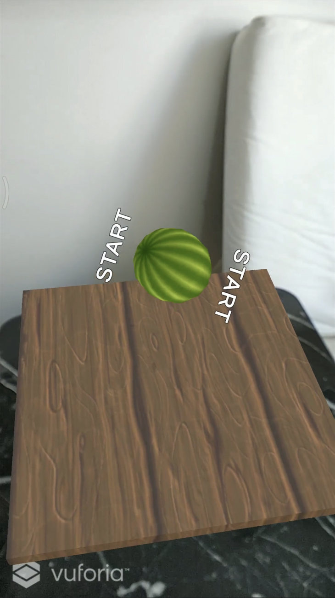
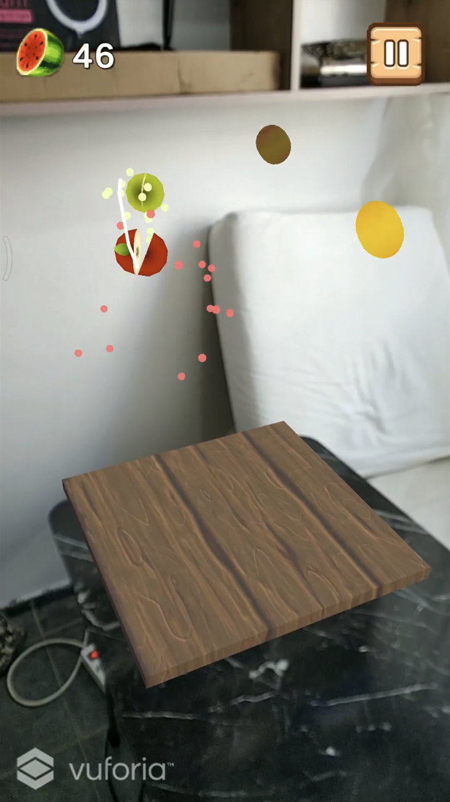
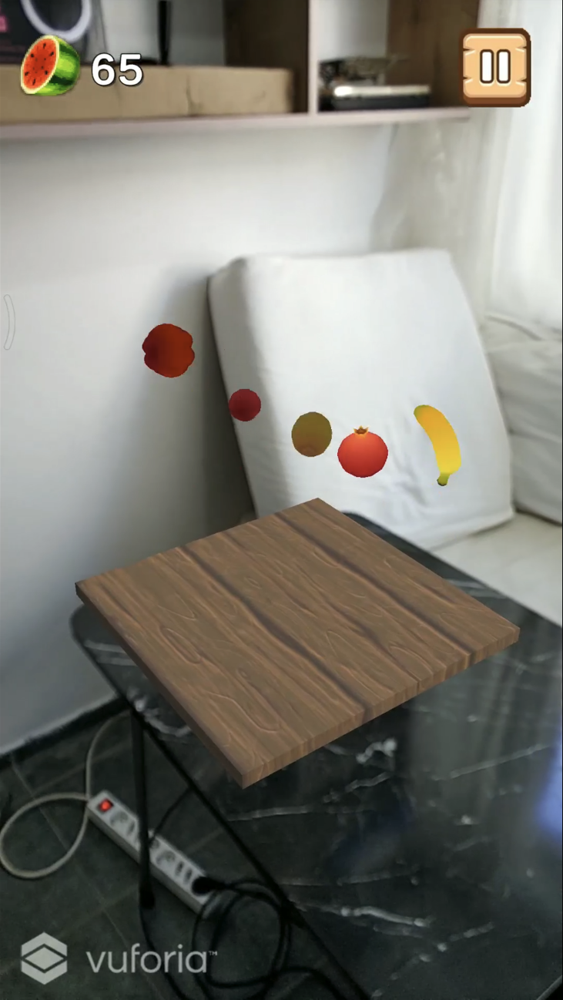
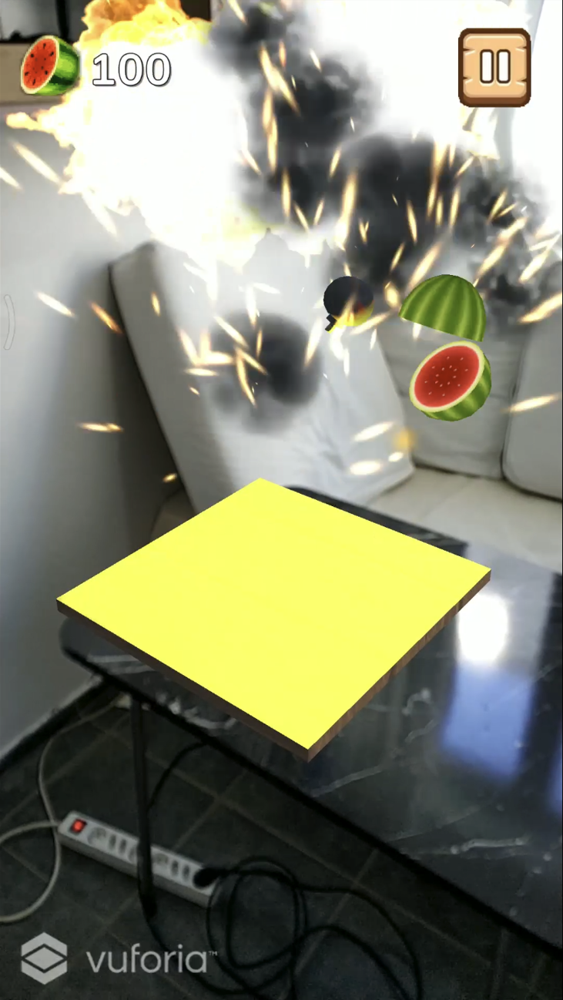
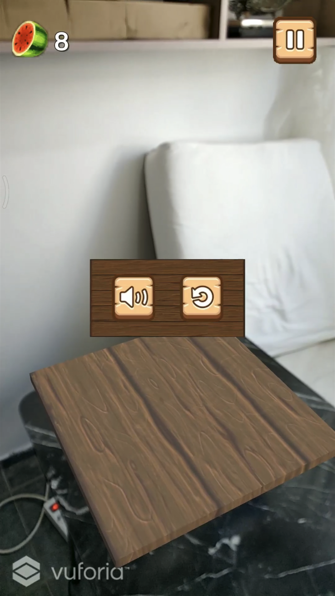

# FruitNinjaAR

FruitNinjaAR is a mobile Augmented Reality (AR) version of the popular game Fruit Ninja. It is made with Unity Engine.

Gameplay: [YouTube](https://www.youtube.com/watch?v=jJ98C5rYZdU)

## Screenshots

### Start

### Gameplay

### Pause Menu

